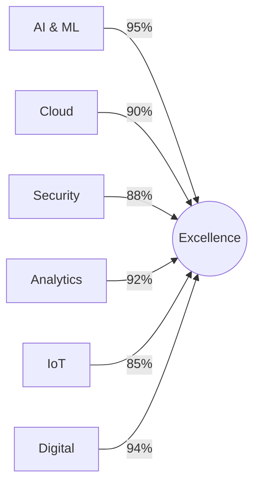

# 
⚡ ELYSAPUTRA VENTURES ⚡

  
  

> _"Transforming Tomorrow Through Innovation Today"_

---

  
  

## 🚀 Pioneering Digital Excellence

Leading the future of technology with cutting-edge solutions and innovative thinking

## 🌟 Who We Are

<table>
<tr>
<td width="50%">

### Our Vision

Transform the digital landscape through innovative solutions that empower businesses and shape the future of technology.

</td>
<td width="50%">

### Our Mission

Deliver exceptional technological solutions that drive digital transformation and create lasting value for our clients.

</td>
</tr>
</table>

## 💫 Core Values

|          🎯 Innovation           |        ⭐ Excellence         |            🤝 Integrity             |            💡 Client-Centric             |
| :------------------------------: | :--------------------------: | :---------------------------------: | :--------------------------------------: |
| Pushing boundaries in technology | Delivering premium solutions | Building trust through transparency | Understanding and exceeding expectations |

## 🔥 Our Solutions

<b>🤖 AI & Machine Learning</b>

- Custom AI Solutions
- Predictive Analytics
- Natural Language Processing
- Computer Vision
- Machine Learning Implementation

<b>☁️ Cloud Computing</b>

- Cloud Migration
- Infrastructure Management
- Hybrid Cloud Solutions
- Performance Optimization
- Cloud Security

<b>🔒 Cybersecurity</b>

- Security Assessment
- Threat Detection
- Data Protection
- Security Compliance
- Incident Response

<b>🚀 Digital Innovation</b>

- Digital Transformation
- Process Automation
- IoT Solutions
- Enterprise Software
- Mobile Applications

## 📊 Our Expertise

## 🏆 Achievements

| 🌐 100+            | ⏳ 10+           | ✨ 500+            | 💯 95%              |
| ------------------ | ---------------- | ------------------ | ------------------- |
| Enterprise Clients | Years Experience | Projects Completed | Client Satisfaction |

## 🤝 Let's Connect

| Contact Method | Details             |
| -------------- | ------------------- |
| 📧 Email       | eddyyucca@gmail.com |
| 📱 Phone       | 081250653005        |
| 📍 Location    | Jakarta, Indonesia  |

---

### 🌟 Building Tomorrow's Technology Today 🌟

© 2025 ELYSAPUTRA VENTURES | All Rights Reserved

Powered by Innovation • Driven by Excellence

